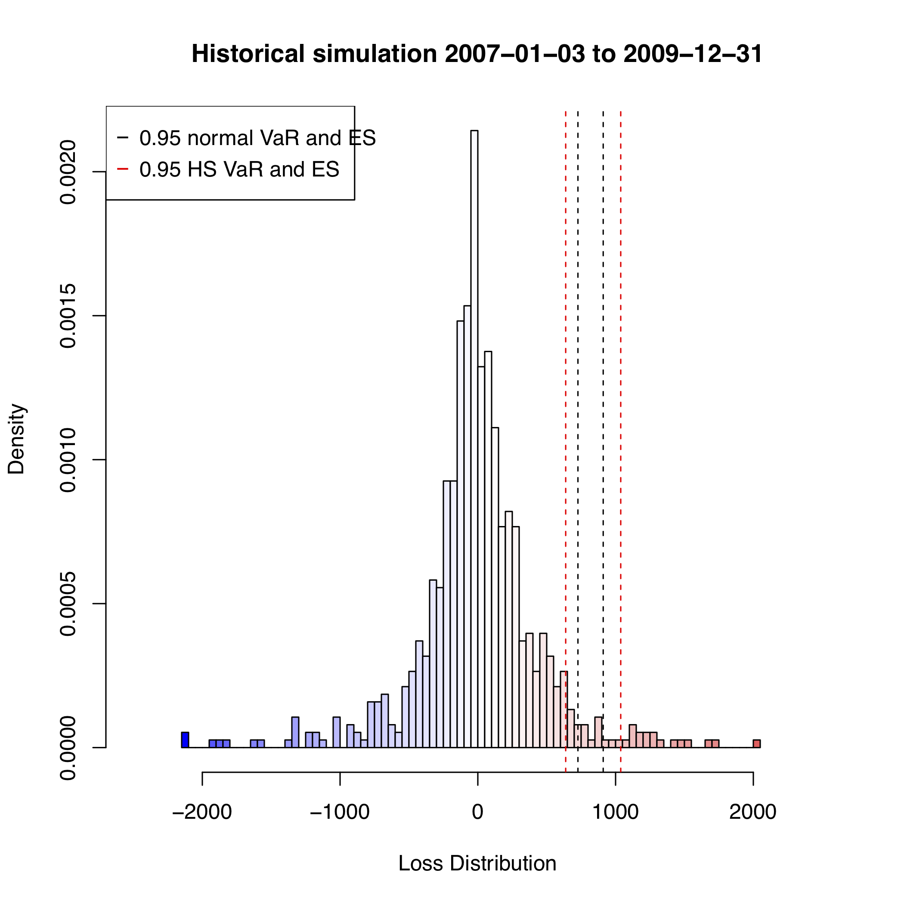
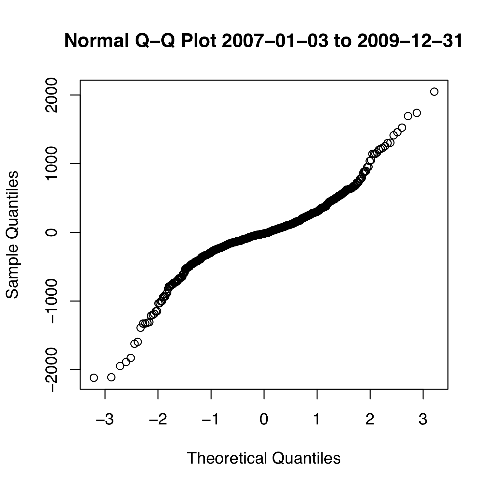
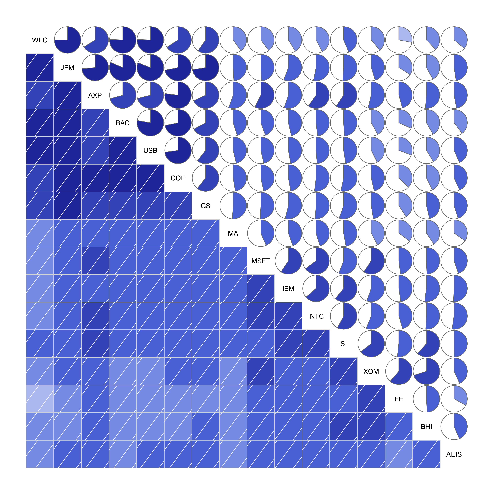
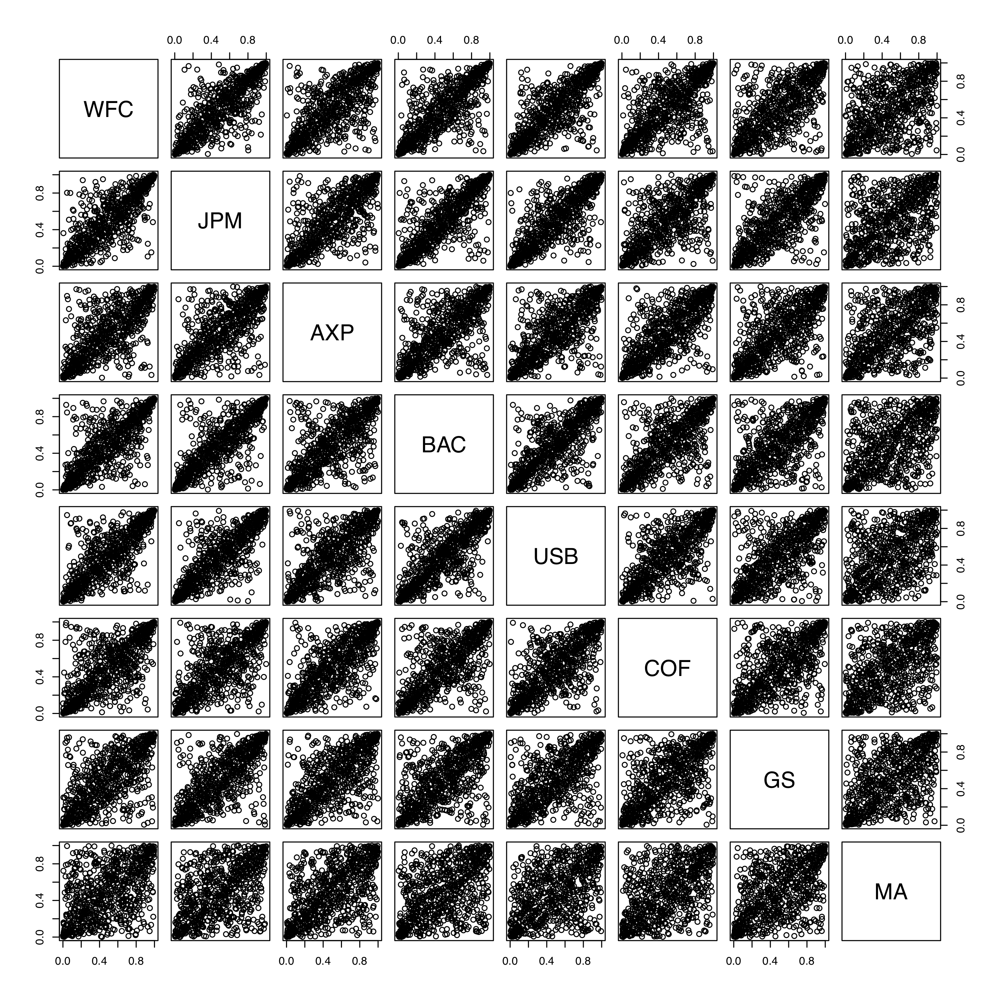
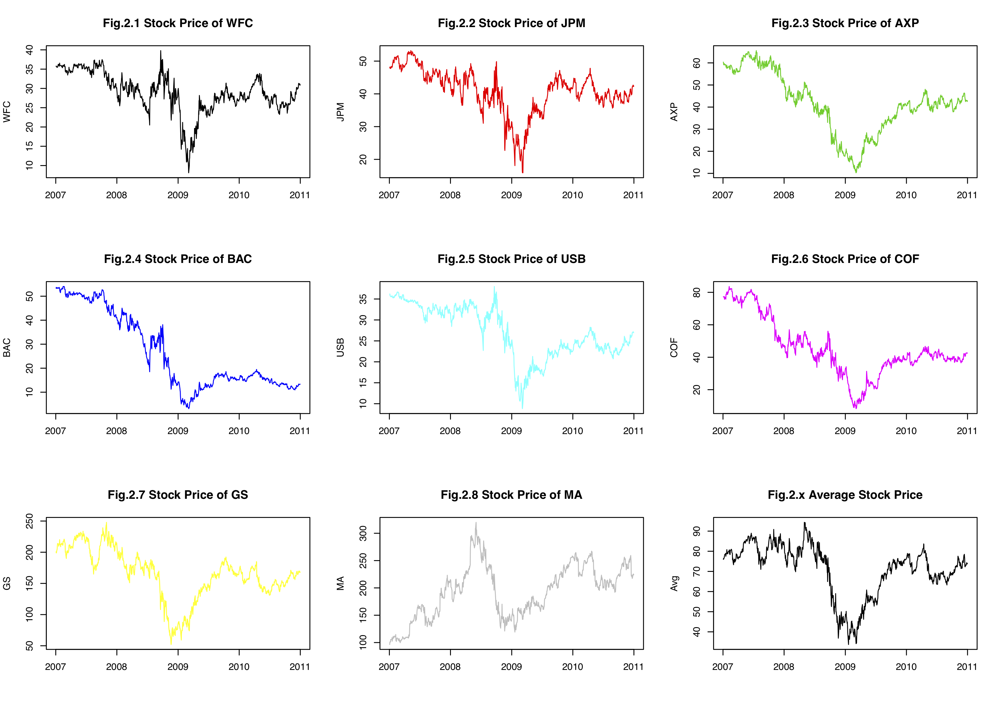

# Statistical Analysis of Global Financial Crisis 2007/09
by **Qin Yu**, Jun 2018  

This is the coursework for the master level statistics course [ME317](https://www.lse.ac.uk/study-at-lse/Summer-Schools/Summer-School/Assets/Documents/Course-Outlines/2018/Research-Methods-Data-Science-and-Mathematics/ME317-course-outline-2018.pdf)/[ST429](https://www.lse.ac.uk/resources/calendar2020-2021/courseGuides/ST/2020_ST429.htm) Statistical Methods for Risk Management at LSE.

To analyse the stock price data, statistically, during the Global Financial Crisis, the auther
used R on selected once including 8 stocks for the financial industry (and the average), 4
stocks for the technology industry, and 4 stocks for the energy industry, from 1st July 2006
to 30th june 2011 (but focus on 1st Jan. 2007 to 31st Dec 2010). With illustrations, we shall
see from a mathematical and statistical point of view, what happend to these industries in
the Global financial crisis.

## Selected Graphs

### Historical Simulation & Quantile-Quantile

  
  

### Pairwise Scatter & Copula

  
  
  

### Stock Prices

  

